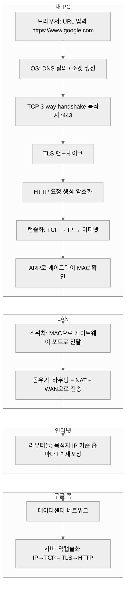
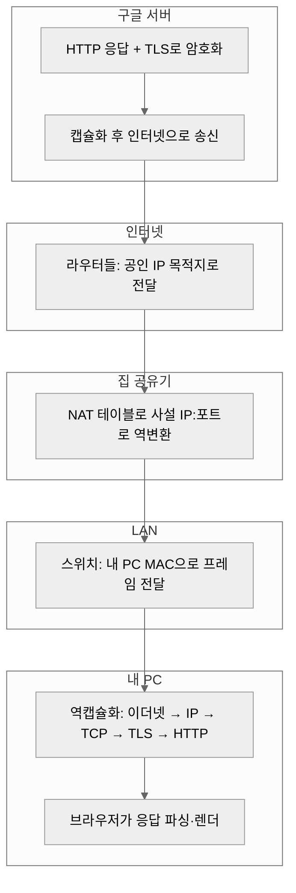

# 브라우저에서 구글(https) 접속 시 네트워크 흐름

<a id="toc-top"></a>

브라우저 주소창에 `https://www.google.com`을 입력했을 때, **DNS부터 물리 계층까지** 어떤 장비가 어떤 정보를 보고 패킷을 넘기는지 한 번에 정리한 문서입니다. 그 전에 **OSI 7계층**, **서브넷·게이트웨이·사설 IP 범위·주소 할당**처럼 흐름을 읽을 때 계속 등장하는 기초를 짧게 모아 두었다.

<a id="toc-contents"></a>

## 목차

GitHub·VS Code 미리보기 등에서 **항목을 클릭하면 해당 절로 이동**한다. 각 절에는 고정 `id`가 붙어 있다.

### Part A · 기초

- [OSI 참조 모델 7계층](#toc-osi)
  - [OSI와 TCP/IP 4계층 대응(요약)](#toc-osi-tcpip)
- [네트워크 기초 보충: 서브넷, 게이트웨이, IP 범위와 할당](#toc-basics)
  - [사설(Private) IPv4 주소 범위](#toc-private-ip)
  - [서브넷(Subnet)과 서브넷 마스크 · CIDR](#toc-subnet)
  - [/24에서 네트워크 주소·브로드캐스트·게이트웨이 (192.168.0.x 예)](#toc-subnet-special)
  - [기본 게이트웨이(Default gateway)](#toc-default-gw)
  - [IP가 기기에 붙는 방식 (할당)](#toc-ip-assign)

### Part B · 브라우저에서 구글(https)까지

- [1. DNS: 이름을 IP로 바꾸기](#toc-dns)
  - [같은 내부망(LAN)에서 서로 통신할 때](#toc-lan-direct)
- [2. TCP 연결과 “4원소”로 보는 연결](#toc-tcp-four)
  - [TCP와 UDP (전송 계층, 개념)](#toc-tcp-udp)
- [3. 데이터 포장: HTTP → TCP → IP → 이더넷(MAC) → 물리](#toc-encapsulation)
  - [HTTP 메시지 구조 (요청·응답, 개념)](#toc-http-message)
  - [이더넷 II 프레임 구조 (개념)](#toc-ethernet-frame)
- [4. ARP: “다음 홉”의 MAC을 알아내기](#toc-arp)
- [5. 장비별 역할 (한 줄 요약)](#toc-devices)
  - [통합 홈 게이트웨이(공유기): 여러 장비 역할을 한 기기에서](#toc-integrated-gw)
  - [L2: 스위치(Switch)](#toc-l2-switch)
  - [L3: 공유기(홈 게이트웨이, 라우터 + NAT + 방화벽이 한 박스에 있는 경우가 많음)](#toc-l3-home)
  - [인터넷 구간: 라우터들의 집합](#toc-internet-routers)
  - [서버 측](#toc-server-side)
- [6. 응답이 돌아올 때 (NAT 복원)](#toc-nat-reply)
- [7. 전체 장비 흐름(한눈에)](#toc-path-diagram)
- [8. 장비 역할 표](#toc-device-table)
- [9. 꼭 기억하면 좋은 여섯 가지](#toc-six-keys)
- [10. HTTPS에 대해 한 줄만 더](#toc-https-note)
- [11. 플로우 차트: 요청이 서버에 닿을 때 · 응답이 브라우저에 닿을 때](#toc-flowcharts)
  - [11.1 요청 경로: 브라우저에서 시작해 구글 서버까지](#toc-flow-request)
  - [11.2 응답 경로: 구글 서버에서 브라우저까지](#toc-flow-response)

### 부록

- [참고](#toc-notes)

[↑ 맨 위(제목)로](#toc-top)

---

<a id="toc-osi"></a>

## OSI 참조 모델 7계층

**OSI**(Open Systems Interconnection)는 통신 기능을 **역할별 층**으로 나눈 **참조 모델**이다. 실제 인터넷 프로토콜 스택은 **TCP/IP 4계층**에 더 가깝지만, 문서·자격증·장비 설명에서 **“L2 스위치, L3 라우터, L7 방화벽”**처럼 **OSI 계층 번호**가 자주 나오므로 표로 한 번 정리해 두는 것이 좋다.

| 계층 | 이름 (영문) | PDU(단위) | 하는 일(개념) | 예시 |
|:----:|-------------|-----------|---------------|------|
| **7** | Application (응용) | 데이터 | 사용자·앱에 가장 가까운 **데이터 형식과 규약** | HTTP, HTTPS(앱 관점), DNS, SSH |
| **6** | Presentation (표현) | — | 인코딩·압축·암호 등 **표현** (교과서·시험에서 강조; 실무 설명은 L4·L7과 겹쳐 말하기도 함) | (TLS를 여기 두기도 함) |
| **5** | Session (세션) | — | 대화·연결의 **유지·동기화** (경계가 흐릿한 경우가 많음) | — |
| **4** | Transport (전송) | **세그먼트**(TCP) / **데이터그램**(UDP) | **종단 간** 전달, **포트**로 앱 구분, TCP는 신뢰성·순서 등 | TCP, UDP |
| **3** | Network (네트워크) | **패킷** | **논리 주소(IP)**로 **호스트 간** 경로 선택·전달 | IP, ICMP, **라우터** |
| **2** | Data Link (데이터 링크) | **프레임** | **같은 링크(한 홉)** 안에서 **MAC**으로 전달, 오류 검출 등 | 이더넷, **스위치**, ARP |
| **1** | Physical (물리) | 비트 | 케이블·광·무선 등 **매체** 위의 신호 | NIC, 트랜시버, 리피터 허브 |

**PDU**(Protocol Data Unit)는 그 계층에서 부르는 **데이터 덩어리 이름**이다. 아래로 갈수록 헤더가 하나씩 붙는 **캡슐화**는 보통 **7→4→3→2→1** 순서로 이해하면 되고(5·6은 생략·통합해서 설명되기도 함), 이 문서 **3절**의 “HTTP → TCP → IP → MAC → 물리”와 같은 줄기다. 수신 쪽은 **역순으로 벗겨** 올라간다.

<a id="toc-osi-tcpip"></a>

### OSI와 TCP/IP 4계층 대응(요약)

인터넷에서는 흔히 **TCP/IP**로만 말한다. 대략적인 짝은 아래와 같다.

| TCP/IP (흔한 한글명) | OSI 계층(대응) |
|----------------------|----------------|
| 응용 (Application) | **5·6·7**을 한 덩어리로 묶어서 설명하는 경우가 많음 |
| 전송 (Transport) | **4** |
| 인터넷 (Internet) | **3** |
| 네트워크 접속 / 링크 (Network access, Link) | **1·2** |

---

<a id="toc-basics"></a>

## 네트워크 기초 보충: 서브넷, 게이트웨이, IP 범위와 할당

이 절은 “구글 접속 한 바퀴”와 별도로, **공부하면서 꼭 같이 잡아 두면 좋은 말뭉치**다. 아래 **1절 이후**에서 나오는 “같은 서브넷 / 게이트웨이로 보낸다” 표현이 여기 정의와 맞물린다.

<a id="toc-private-ip"></a>

### 사설(Private) IPv4 주소 범위

인터넷 전역 라우팅 테이블에 **그대로는 올라가지 않도록** 아래 대역은 **LAN·사내용(사설)**으로 쓰도록 정해져 있다(RFC 1918). 집 공유기 뒤 PC·휴대폰에 흔히 붙는 것이 이쪽이다.

| 대역 (CIDR) | 주소 범위 (개념) | 흔한 용도 |
|---------------|------------------|-----------|
| `10.0.0.0/8` | `10.0.0.0` ~ `10.255.255.255` | 대형 사내망, Docker/가상망, 일부 ISP |
| `172.16.0.0/12` | `172.16.0.0` ~ `172.31.255.255` | 사무·클라우드 VPC 등 |
| `192.168.0.0/16` | `192.168.0.0` ~ `192.168.255.255` | 가정용 공유기 LAN이 가장 흔함 |

**공인(Global) IP**는 ISP 등이 배포하고, 사설 주소는 **NAT**(이 문서 뒤쪽)으로 공인 쪽과 붙인다. “내 PC IP가 `192.168.x.x`인데 구글은 `142.x.x.x`다”는 차이가 바로 여기서 온다.

그 외 자주 보는 특수 목적:

| 대역 | 비고 |
|------|------|
| `127.0.0.0/8` | **루프백**. 대표 `127.0.0.1`(localhost) — 자기 자신 |
| `169.254.0.0/16` | **링크 로컬**(APIPA). DHCP 실패 시 OS가 임시로 쓰는 경우가 많음 — 같은 망에서만 의미 있음 |

IPv6는 별 체계이나, 공부용으로는 **루프백 `::1`**, 사설에 가까운 **ULA `fc00::/7`** 정도만 알아도 다음 학습으로 이어지기 좋다.

<a id="toc-subnet"></a>

### 서브넷(Subnet)과 서브넷 마스크 · CIDR

한 호스트는 자기 IP와 함께 **“어디까지가 같은 네트워크(서브넷)인지”**를 알아야 한다. IPv4에서는 **서브넷 마스크**(예: `255.255.255.0`) 또는 **CIDR 접두 길이**(예: `/24`)로 표현한다.

- **`/24`**는 앞 24비트가 **네트워크 부분**, 나머지 8비트가 **호스트 부분**이라는 뜻에 가깝다. `192.168.0.10/24`와 `192.168.0.20/24`는 **같은 서브넷**.
- **`192.168.0.10/24`**와 **`192.168.1.10/24`**는 **다른 서브넷**(세 번째 옥텟이 다름).

OS의 판단(개념):

- **목적지가 나와 같은 서브넷** → **게이트웨이가 아니라**, ARP 등으로 **그 호스트의 MAC**을 찾아 L2로 직접 보낸다.
- **목적지가 다른 서브넷** → **기본 게이트웨이(공유기 LAN IP)**에게 넘기고, 이후 라우팅은 게이트웨이가 맡는다.

그래서 “서브넷을 안다”는 것은 **패킷을 스위치로 바로 던질지, 공유기로 올릴지**를 가르는 기준이 된다.

<a id="toc-subnet-special"></a>

### /24에서 네트워크 주소·브로드캐스트·게이트웨이 (192.168.0.x 예)

아래는 가정용에서 흔한 **`192.168.0.0/24`**(마스크 `255.255.255.0`) 한 덩어리를 기준으로 한 정리다. **“네트워크 주소 / 브로드캐스트는 못 쓴다”**는 식의 규칙은 **서브넷 크기(/24 등)에 따라** 달라지므로, 여기서는 전형적인 /24만 본다.

| 주소 (예) | 역할 | 설명 |
|-----------|------|------|
| **`192.168.0.0`** | **네트워크 주소** | 이 서브넷을 가리키는 **식별용 주소**. 보통 **호스트(내 PC 등)에 직접 붙이지 않는다.** (라우팅·문서에서 “192.168.0.0/24 망”처럼 쓸 때의 그 .0) |
| **`192.168.0.1`** | **(흔히) 기본 게이트웨이 = 공유기 LAN IP** | 집 공유기가 **관례적으로** LAN 주소를 `.1`로 잡는 경우가 많다. **반드시 .1인 것은 아니다**(`192.168.0.254`, `192.168.1.1` 등도 흔함). |
| **`192.168.0.2` ~ `192.168.0.254`** | **그 외 호스트 주소(전형적인 /24)** | PC·휴대폰·NAS 등에 DHCP나 수동으로 붙는 **일반 호스트 풀**(관리 정책에 따라 일부는 비워 두기도 함). |
| **`192.168.0.255`** | **(디렉티드) 브로드캐스트** | **같은 서브넷 안의 모든 호스트**를 향하는 **목적지 IP**. 이더넷에서는 종종 **FF:FF:FF:FF:FF:FF**로도 퍼져 나간다. |

**브로드캐스트와 “UDP만”이 아닌 이유:** `192.168.0.255`는 **IP 계층의 목적지 주소**이다. 그 위에 **UDP**로내면 “UDP 브로드캐스트”처럼 부르고, **mDNS·DHCP(Discover)** 등에서 비슷한 맥락이 나온다. 다만 **TCP는 브로드캐스트에 연결을 거는 식으로 쓰지 않는다**는 식으로 동작이 갈린다. 즉 “255 = UDP 전용”이 아니라 **“이 서브넷 전체(개념)”를 향하는 IP**에 가깝다.

**주의(보안·운영):** 라우터나 OS가 **디렉티드 브로드캐스트를 막거나 제한**하는 경우가 있다. 또 **로컬 전체**로 쓸 때 목적지를 **`255.255.255.255`(제한된 브로드캐스트)**로 쓰는 프로토콜도 있다(의미는 “이 링크 전체”에 가깝게 해석된다).

**`192.168.0.1` = 공유기(게이트웨이)?** 집에서는 **그렇게 잡아 두는 경우가 매우 많아서** 체감상 “공식”처럼 느껴지지만, **프로토콜이 `.1`만 게이트웨이로 정해 놓은 것은 아니다.** 공유기 제조사·펌웨어에 따라 **`192.168.0.254`**, **`192.168.1.1`**(다른 서브넷), **`10.0.0.1`** 등 **서브넷 안의 아무 유효 호스트 주소**나 게이트웨이가 될 수 있다. **실제 기본 게이트웨이는 DHCP로 받은 값·공유기 설정을 보면 된다.**

<a id="toc-default-gw"></a>

### 기본 게이트웨이(Default gateway)

**“우리 망 밖으로 나가는 기본 출구”**에 해당하는 **다음 홉 라우터의 IP**다. 집에서는 거의 항상 **공유기 LAN 쪽 인터페이스 주소**이고, 흔히 **`192.168.0.1`**처럼 보이지만 **위 표에서 말했듯 관례일 뿐**이다. PC에 **기본 게이트웨이**가 비어 있거나 틀리면, 인터넷은 커녕 **다른 서브넷**과도 통신이 안 되는 경우가 많다.

DHCP로 설정을 받으면 보통 **IP, 서브넷 마스크, 게이트웨이, DNS 서버**가 한꺼번에 온다.

<a id="toc-ip-assign"></a>

### IP가 기기에 붙는 방식 (할당)

| 방식 | 설명 |
|------|------|
| **DHCP** | 공유기(또는 사내 DHCP 서버)가 **임대(lease)** 기간을 두고 IP·마스크·게이트웨이·DNS를 자동 배포. 가정용에서 가장 흔함. |
| **고정(Static) / 수동** | 관리자가 IP·마스크·게이트웨이·DNS를 직접 입력. 서버·NAS·프린터에 자주 사용. **같은 망 안에서 주소 충돌**만 피하면 됨. |
| **예약(Reservation)** | DHCP이지만 특정 MAC에는 항상 같은 IP를 주도록 공유기에 등록하는 방식(고정에 가깝게 쓰기 좋음). |

에페메럴 **TCP/UDP 포트**(예: `52341`)는 **OS가 연결마다 임시로 할당**하는 것이고, **호스트의 IPv4 주소 자체**와는 구분해서 보면 된다(이 문서 **2절** 4-tuple).

---

<a id="toc-dns"></a>

## 1. DNS: 이름을 IP로 바꾸기

1. 브라우저(또는 OS의 스텁 리졸버)가 `www.google.com`의 IP를 알아야 한다.
2. 보통 **로컬 캐시 → OS 캐시 → 공유기(또는 ISP) DNS → 재귀/권한 DNS** 순으로 질의가 이어진다.
3. 결과로 **구글 쪽 서버(또는 CDN 엣지)의 IPv4/IPv6 주소**를 얻는다. 이후 모든 “최종 목적지” 판단은 이 **IP**를 기준으로 한다.

HTTPS이므로 기본 포트는 **443**(TLS가 그 위에서 동작).

<a id="toc-lan-direct"></a>

### 같은 내부망(LAN)에서 서로 통신할 때

**목적지를 IP로 이미 알고 있으면** (예: `192.168.0.20`, NAS·프린터에 고정 IP를 넣고 접속하는 경우) **위에서 말한 “이름 → IP” DNS 질의 과정은 필요 없다.** 소켓을 만들 때 **목적지에 IP가 곧바로 들어가면**, OS는 **같은 서브넷인지**만 판단하고, 같은 망이면 보통 **ARP로 상대 호스트의 MAC**을 구한 뒤 **스위치를 통해 그 장비로** 프레임을 보낸다. 인터넷으로 나갈 때처럼 **공유기 밖의 DNS 서버**를 거칠 이유가 없다.

정리하면, **내부 장비끼리 “IP로 직접” 통신**하는 전형적인 경우는 **DNS(공인 도메인 해석) 없이** **IP + ARP + L2 전달**로 끝나는 쪽에 가깝다.

**이름(호스트명)으로 접속**하면 상황이 달라진다. 예를 들어 `http://printer01`처럼 쓰면 **어딘가에서 이름을 IP로 바꾸는 단계**는 필요할 수 있다. 다만 그건 반드시 인터넷 DNS가 아니라 **이 PC의 hosts 파일**, **사내/공유기의 로컬 DNS**, **mDNS(`.local`)** 같은 **내부·로컬 이름 해석**인 경우가 많다. 이 문서 **1절**에서 말하는 흐름은 주로 **`www.google.com` 같은 공인 도메인**을 브라우저에 넣었을 때의 DNS다.

---

<a id="toc-tcp-four"></a>

## 2. TCP 연결과 “4원소”로 보는 연결

1. 클라이언트는 **구글 IP의 443 포트**로 TCP **SYN**을 보낸다.
2. OS는 **임시(에페메럴) 출발지 포트**를 하나 할당한다(예: `52341`).

이때 하나의 TCP 연결은 아래 **네 가지**로 구분된다(4-tuple).

| 항목 | 예시(개념) |
|------|------------|
| 출발지 IP | `192.168.0.10` (사설, LAN) |
| 출발지 포트 | `52341` |
| 목적지 IP | `142.x.x.x` (구글 쪽, 개념) |
| 목적지 포트 | `443` |

같은 PC에서 여러 탭·여러 사이트가 동시에 붙을 수 있는 이유가, **IP+포트 조합이 연결마다 달라지기** 때문이다.

<a id="toc-tcp-udp"></a>

### TCP와 UDP (전송 계층, 개념)

L4(전송 계층)는 **같은 IP(호스트) 안에서** “어느 프로그램으로 올릴지”를 **포트 번호**로 구분한다. IP가 **건물 주소**라면 포트는 **호실 번호**에 가깝다.

| 구분 | TCP | UDP |
|------|-----|-----|
| **연결** | **연결 지향**. **3-way handshake**(SYN → SYN-ACK → ACK)로 연결을 잡은 뒤 스트림처럼 주고받음 | **비연결**. 사전 핸드셰이크 없이 **데이터그램**을 목적지 포트로 보냄 |
| **신뢰성·순서** | 누락 시 재전송, 순서 맞추기 등 **신뢰성**에 무게 | **최선형 배달**(best effort). 지연·손실은 애플리케이션이 감수하거나 보완 |
| **흔한 용도** | **HTTP/HTTPS**, SSH, SMTP 등 “바이트 스트림”에 잘 맞는 경우 | **DNS 질의**(응답이 크면 TCP로 가기도 함), 일부 실시간 음성·영상·게임 트래픽 등 |

**웰노운 포트** 예: HTTP **80**, **HTTPS TCP 443**, DNS **53**.

**TCP 세그먼트**는 **TCP 헤더**(출발/목적 포트, 시퀀스·ACK 번호, 플래그 등)와 **페이로드**로 이루어진다. 페이로드 안에는 **상위 프로토콜 바이트**가 들어가는데, 웹이라면 **평문 HTTP**이거나 **TLS 레코드**(암호화된 HTTP)다. 데이터가 길면 **여러 세그먼트**로 쪼개져 같은 TCP 연결로 순서대로 전달된다.

---

<a id="toc-encapsulation"></a>

## 3. 데이터 포장: HTTP → TCP → IP → 이더넷(MAC) → 물리

애플리케이션에서 만든 **HTTP 요청**(TLS 핸드셰이크·암호화 이후에는 페이로드가 ciphertext)은 아래 순서로 **아래 계층에 실려** 나간다.

```
HTTP(애플리케이션) → TCP(세그먼트) → IP(데이터그램) → 이더넷 프레임(MAC) → 전기/광 신호
```

<a id="toc-http-message"></a>

### HTTP 메시지 구조 (요청·응답, 개념)

HTTP는 클라이언트와 서버가 주고받는 **애플리케이션 계층 메시지** 규약이다. 아래는 **HTTP/1.1**을 텍스트로 표현했을 때의 전형적인 뼈대다(HTTP/2·HTTP/3은 **프레임·스트림** 등으로 바이너리화되어 있으나, “요청/응답 + 헤더 + 본문”이라는 개념은 이어진다).

**요청(Request)** — 대략적인 순서:

1. **요청 줄(Request line)**: `METHOD SP 요청-대상 SP HTTP-버전 CRLF`  
   예: `GET / HTTP/1.1`
2. **헤더**: `Host`, `User-Agent`, `Accept` 등 `이름: 값` 형태가 한 줄씩
3. **빈 줄**(CRLF만 한 줄) — 헤더 끝 표시
4. **본문**(선택): POST·PUT 등에서 폼 데이터·JSON 등

**응답(Response)**:

1. **상태 줄(Status line)**: `HTTP-버전 SP 상태코드 SP 사유-문구 CRLF`  
   예: `HTTP/1.1 200 OK`
2. **헤더**: `Content-Type`, `Content-Length`, `Set-Cookie` 등
3. **빈 줄**
4. **본문**: HTML·JSON·이미지 바이너리 등

브라우저가 **`https://`** 로 접속하면 위 HTTP 바이트는 **곧바로 TCP에 실리지 않고**, 먼저 **TLS**로 암호화된 **레코드** 형태로 TCP 페이로드에 올라간다(이 문서 **10절**). 중간의 라우터·스위치는 보통 **HTTP 내용을 해석하지 않고**, **IP·포트·프로토콜 번호**만 보고 넘긴다.

**여기서 헷갈리기 쉬운 점:**

- **IP 헤더의 목적지 IP**는 “이 세션이 최종적으로 가야 할 호스트” 쪽(구글 쪽 주소)을 가리킨다.
- **이더넷 프레임의 목적지 MAC**은 “지금 이 홉에서 **다음에 받을 장비**”의 MAC이다. LAN에서 첫 홉은 거의 항상 **기본 게이트웨이(공유기 LAN 포트)**다.

<a id="toc-ethernet-frame"></a>

### 이더넷 II 프레임 구조 (개념)

LAN에서 IP를 실어 나를 때 흔히 보는 형태가 **이더넷 II(Ethernet II, DIX)** 프레임이다. **IP 데이터그램 전체**가 여기의 **페이로드(데이터 필드)** 안에 들어간다고 보면 된다.

| 필드(순서) | 크기(대표) | 역할 |
|------------|------------|------|
| **목적지 MAC** | 6바이트 | 이 링크에서 **다음에 받을 NIC**의 주소. 브로드캐스트면 **`FF:FF:FF:FF:FF:FF`** |
| **출발지 MAC** | 6바이트 | 보내는 쪽 NIC 주소 |
| **EtherType** | 2바이트 | 뒤에 실린 상위 프로토콜 종류. **IPv4는 `0x0800`**, IPv6는 `0x86DD` 등 |
| **페이로드** | 46~1500바이트(전형) | 여기에 **IP 헤더 + IP 페이로드**(대개 TCP/UDP 세그먼트)가 통째로 들어감 |
| **FCS** | 4바이트 | **프레임 오류 검사**(CRC). 수신 NIC가 틀리면 폐기할 수 있음 |

맨 앞의 **프리앰블·SFD**(동기용)는 “비트를 맞춘다” 쪽에 가깝고, 많은 설명서에서는 **L1/L2 경계**로만 짚고 넘어간다.

**MTU**(Maximum Transmission Unit): 이더넷에서 흔히 **1500바이트**라고 말하는 것은 보통 **페이로드 상한**(IP 입장에선 한 번에 실을 수 있는 크기)을 가리킨다. 더 큰 데이터는 IP에서 **분할(단편화)**하거나 상위에서 나누어 보낸다.

**VLAN(802.1Q):** 사내망 등에서는 **출발지 MAC 뒤·EtherType 앞**에 **태그(4바이트)**가 끼어 **VLAN ID** 등을 실을 수 있다. 개념만 알면 되고, 집 단일 서브넷 설명에는 필수는 아니다.

한 홉을 한 줄로 쓰면 대략 다음과 같다.

```
[이더넷 헤더: 목적지 MAC | 출발지 MAC | EtherType] + [IP 패킷 …] + [FCS]
```

그래서 **“IP는 구글, MAC은 구글이 아니라 공유기(게이트웨이)”**라고 말하는 것이 맞다(첫 LAN 구간 기준). 이때 **이더넷 헤더의 목적지 MAC**만 게이트웨이로 바뀌고, **안쪽 IP 헤더의 목적지**는 여전히 구글 쪽이다.

---

<a id="toc-arp"></a>

## 4. ARP: “다음 홉”의 MAC을 알아내기

목적지 IP가 **같은 서브넷 밖**이면, 호스트는 패킷을 **게이트웨이 IP**로내도록 라우팅 테이블을 쓴다.  
그 다음 **ARP**(또는 캐시)로 **게이트웨이 IP → MAC**을 알아낸 뒤, **이더넷 프레임의 목적지 MAC 필드**에 그 값을 넣어 보낸다(이 문서 **3절** 표의 첫 번째 필드).

같은 서브넷 안의 상대에게 보낼 때도, IP는 이미 알고 MAC만 모르면 **ARP로 IP → MAC**을 채운 뒤 **같은 프레임 형식**으로 스위치에 넘긴다.

---

<a id="toc-devices"></a>

## 5. 장비별 역할 (한 줄 요약)

<a id="toc-integrated-gw"></a>

### 통합 홈 게이트웨이(공유기): 여러 장비 역할을 한 기기에서

집·소형 사무실에서 말하는 **공유기**는 “라우터 하나”만 있는 것이 아니라, **여러 네트워크 기능을 한 박스(또는 펌웨어 한 세트)**에 묶어 둔 경우가 많다. 큰 회사에서는 장비를 나누어 두지만, 가정용은 비용·공간·설정 단순화를 위해 **한 제품이 아래 역할을 겸한다**고 보면 된다.

| 겸하는 역할 | 무슨 일을 하는지 (개념) | 따로 쪼개면 나올 수 있는 장비·구성 |
|-------------|-------------------------|-----------------------------------|
| **L3 라우터** | LAN과 WAN을 나누고, 목적지 IP로 **다음 홉**(보통 ISP)을 정함 | 전용 라우터 |
| **NAT** | 사설 IP·포트 ↔ 공인 IP·포트 변환, **NAT 테이블** 유지 | NAT 박스(또는 방화벽의 일부) |
| **방화벽 / 스테이트풀 필터** | 나가고 들어오는 연결을 정책으로 허용·차단 | 방화벽 어플라이언스 |
| **DHCP 서버** | LAN 기기에 IP·게이트웨이·DNS 주소를 자동 배포 | DHCP 전용 서버 |
| **DNS 프록시 / 전달** | “공유기가 DNS”처럼 보이게 하고, 실제로는 ISP DNS 등으로 **질의를 넘김** | 로컬 DNS 서버 |
| **스위치(소형)** | LAN 포트 여러 개면 **L2 스위칭**으로 같은 망 내 포트 연결 | 스위치 |
| **무선 AP** | Wi-Fi로 L2에 올려 줌 | 별도 액세스 포인트 |
| **PPPoE 등 WAN 클라이언트** | 회선 방식에 맞춰 ISP와 링크를 잡음 | 모뎀·ONT와 짝 |

즉 문맥에 따라 **“공유기 = 라우터 + NAT + (자주) DHCP + DNS 전달 + 방화벽 + Wi-Fi AP + 소형 스위치”**에 가깝다. 이 문서에서는 패킷이 인터넷으로 나갈 때 특히 **라우팅**과 **NAT**이 겹친다는 점만 짚어도 충분하다.

<a id="toc-l2-switch"></a>

### L2: 스위치(Switch)

- **이더넷 프레임 헤더**의 **목적지 MAC**을 보고 **같은 LAN 안**에서 적절한 포트로 전달한다(학습·포워딩). 학습할 때는 **출발지 MAC**과 “어느 포트에서 왔는지”를 MAC 주소 테이블에 쌓는다.
- **페이로드 안의 IP·TCP**는 원칙적으로 보지 않는다(일반 L2 스위치 기준).

**흐름(집/사무 LAN 예시):**  
`내 PC → 스위치 → 공유기(LAN 쪽)`

<a id="toc-l3-home"></a>

### L3: 공유기(홈 게이트웨이, 라우터 + NAT + 방화벽이 한 박스에 있는 경우가 많음)

패킷이 WAN 쪽으로 나갈 때 대표적으로 두 가지가 겹친다.

1. **라우팅**  
   - “이 목적지는 내부가 아니라 **인터넷**으로 나가야 한다”고 경로를 정한다.
2. **NAT(Network Address Translation)**  
   - 사설 주소를 **ISP가 준 공인 IP**(또는 CGNAT 등)와 **다른 출발지 포트**로 바꿔 기록한다.

예시(개념):

- 내부: `192.168.0.10:52341`
- NAT 이후(개념): `203.x.x.x:40001`

공유기는 **NAT 테이블**에 “`203.x.x.x:40001` ↔ `192.168.0.10:52341`” 같은 매핑을 남겨, **응답이 돌아왔을 때 역변환**할 수 있게 한다.

<a id="toc-internet-routers"></a>

### 인터넷 구간: 라우터들의 집합

- **IP 계층의 목적지 IP**는 (중간에 NAT를 제외하면) **최종 목적지를 향해 유지**되는 것이 일반적이다.
- **MAC 주소는 홉마다 바뀐다.** 각 라우터는 IP 데이터그램을 꺼낸 뒤 **다음 홉**으로 보낼 때 **이더넷 헤더를 새로 씀**(목적지·출발지 MAC, FCS 재계산 등). 링크가 이더넷이 아니면 **PPP 등 다른 L2** 프레임으로 감싸기도 한다.

개념적 경로:

`공유기 → ISP 라우터 → 백본/상위 라우터들 → 구글 데이터센터 쪽 네트워크`

<a id="toc-server-side"></a>

### 서버 측

도착한 비트열은 반대 순서로 올라간다. L2에서는 **이더넷 프레임**에서 **FCS 확인·프레임 헤더 제거** 후 **IP 데이터그램**을 IP 계층에 넘긴다.

```
물리 → 이더넷 프레임(L2) → IP(L3) → TCP(L4) → TLS/HTTP(L5~L7)
```

요청 처리 후 **HTTP 응답**이 같은 TCP 연결(또는 스펙에 맞는 방식)으로 돌아온다.

---

<a id="toc-nat-reply"></a>

## 6. 응답이 돌아올 때 (NAT 복원)

1. 서버에서 온 패킷의 **목적지 IP:포트**는 NAT 박스의 **공인 IP:포트**(예: `203.x.x.x:40001`)를 향한다.
2. 공유기는 **NAT 테이블**을 보고 `192.168.0.10:52341`로 **역변환**한 뒤 LAN으로 포워딩한다.
3. 스위치는 다시 MAC 기준으로 **내 PC**에게 프레임을 전달한다.

---

<a id="toc-path-diagram"></a>

## 7. 전체 장비 흐름(한눈에)

```
[내 PC]
    ↓  (이더넷 프레임, 목적지 MAC = 게이트웨이)
[스위치]  ← MAC 기반 전달 (L2)
    ↓
[공유기]  ← 라우팅 + NAT (+ 방화벽) (L3/L4 정책)
    ↓
[인터넷 라우터들]  ← IP 기반 경로 선택 (L3)
    ↓
[구글 서버]
```

---

<a id="toc-device-table"></a>

## 8. 장비 역할 표

| 장비 | 역할 | 주로 보는 계층 |
|------|------|----------------|
| 스위치 | MAC 기반으로 같은 LAN 내 포워딩 | L2 |
| 공유기(홈 게이트웨이) | IP 라우팅, NAT, 종종 방화벽·DNS 프록시 | L3(정책은 L4까지) |
| 라우터(인터넷) | 목적지 IP 기준 다음 홉 결정 | L3 |
| 서버 | TCP/TLS/HTTP 처리 | L4~L7 |

---

<a id="toc-six-keys"></a>

## 9. 꼭 기억하면 좋은 여섯 가지

1. **MAC은 “이 홉의 다음 목적지”** — 최종 목적지와 같다고 착각하기 쉽다.
2. **IP(데이터그램의 목적지)는 “최종 목적지(엔드투엔드 관점)”**에 가깝다(NAT 구간은 예외적으로 출발지/주소 체계가 바뀐다).
3. **스위치는 MAC 기반**이다.
4. **라우터/공유기의 포워딩 결정은 IP(와 정책) 기반**이다.
5. **가정용에서 보이는 NAT는 대개 공유기(게이트웨이)에서 일어난다.**
6. **TCP 연결 하나는 (출발 IP, 출발 포트, 목적 IP, 목적 포트) 네 값으로 식별**한다.

---

<a id="toc-https-note"></a>

## 10. HTTPS에 대해 한 줄만 더

위 설명의 “HTTP” 자리에는 실제로는 **TLS**가 끼어 있다. 즉, TCP가 잡힌 뒤 **클라이언트 헬로·서버 인증서·키 합의** 등이 진행되고, 그 위에서 **HTTP 요청/응답 메시지**(이 문서 **3절** “HTTP 메시지 구조”)가 **암호화된 바이트**로 오간다. 네트워크 장비가 “URL”이나 헤더 문장을 읽는 것이 아니라, **IP·포트·프로토콜 번호·패킷 단위**로 동작한다는 점은 동일하다.

---

<a id="toc-flowcharts"></a>

## 11. 플로우 차트: 요청이 서버에 닿을 때 · 응답이 브라우저에 닿을 때

아래는 **HTTPS로 구글에 접속**한다고 가정한 **논리 순서**다. 실제 구현은 OS·브라우저·캐시·회선에 따라 일부 단계가 생략되거나 순서가 겹칠 수 있다.

<a id="toc-flow-request"></a>

### 11.1 요청 경로: 브라우저에서 시작해 구글 서버까지



<a id="toc-flow-response"></a>

### 11.2 응답 경로: 구글 서버에서 브라우저까지



---

<a id="toc-notes"></a>

## 참고

- 이 문서는 **일반적인 홈/사무 네트워크와 IPv4 + NAT**를 전제로 한 개념 설명이다.
- IPv6·CGNAT·기업 프록시·VPN·분할 DNS 등이 있으면 DNS 경로와 “첫 목적지 MAC”이 달라질 수 있다.

[↑ 목차로](#toc-contents)
