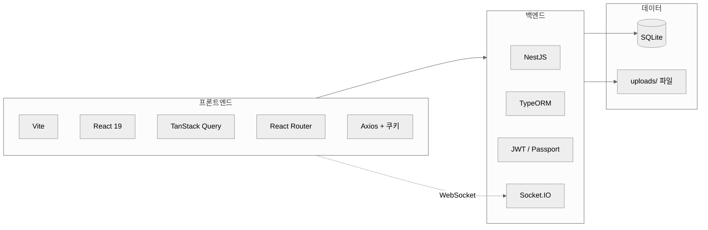
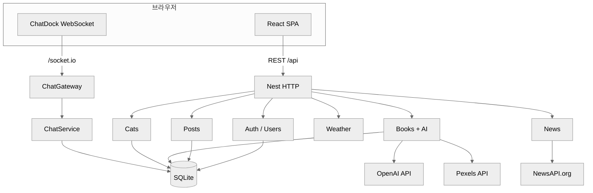
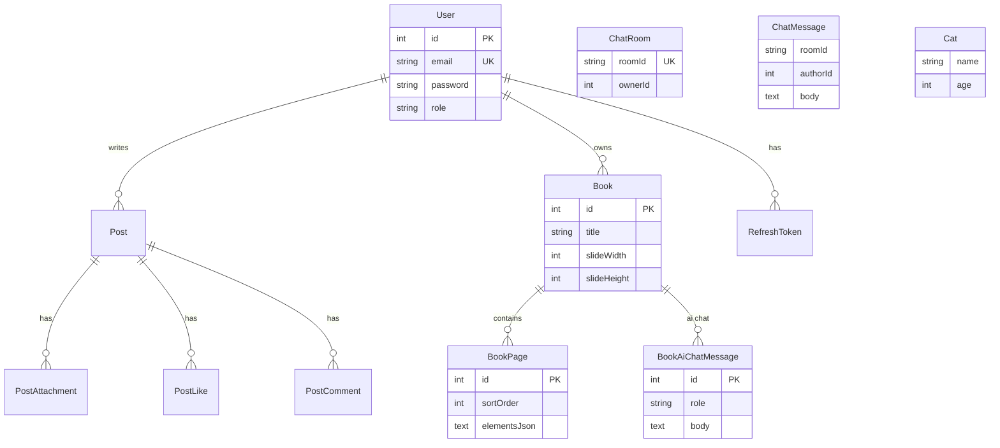
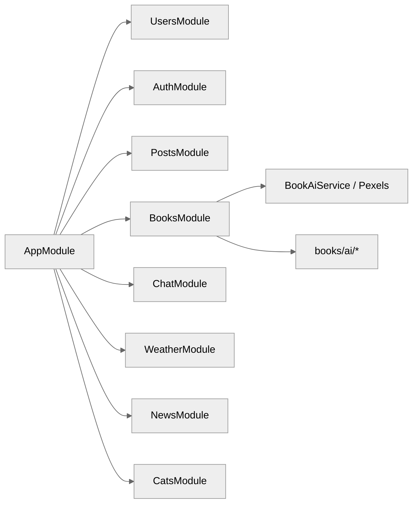
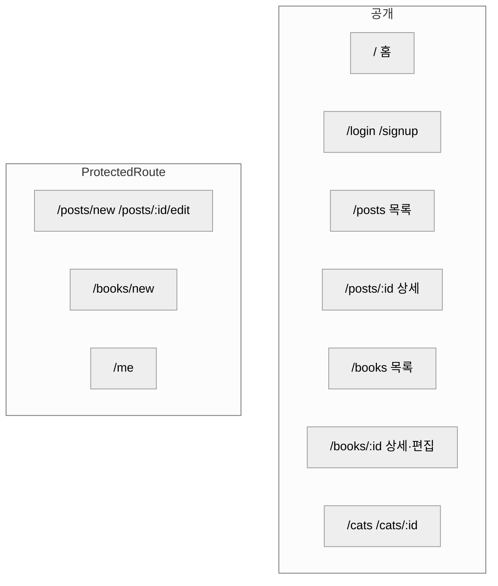
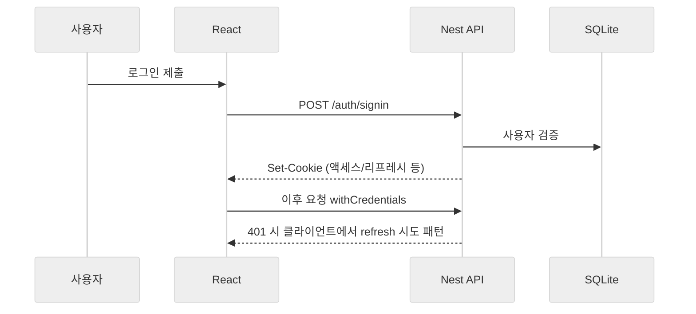
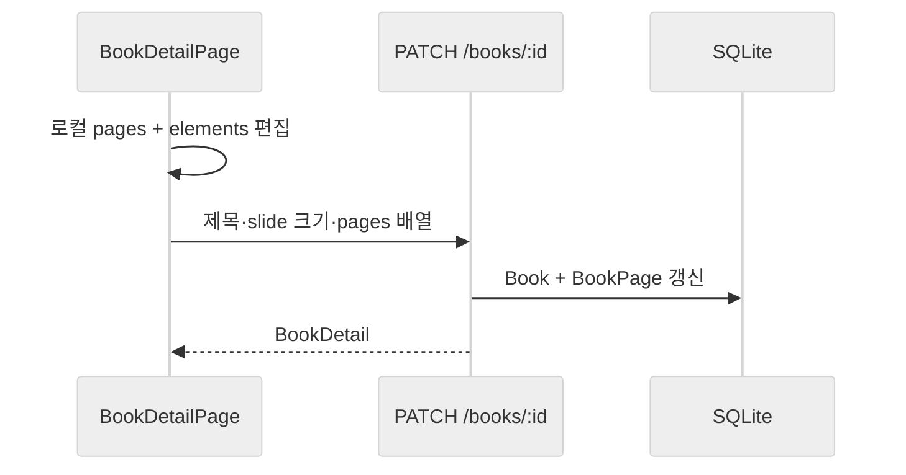
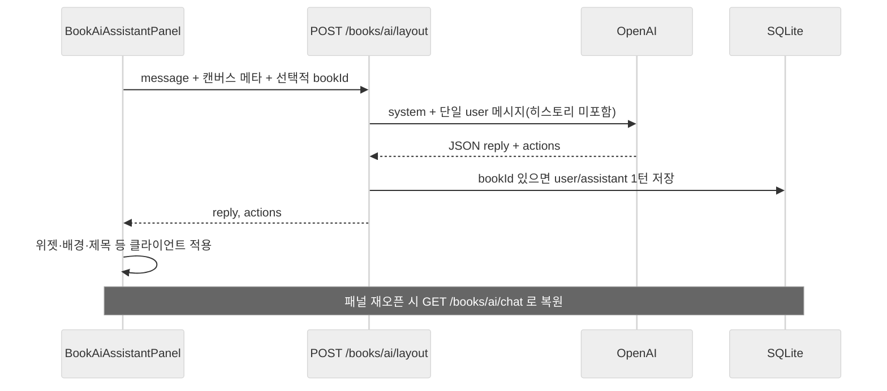
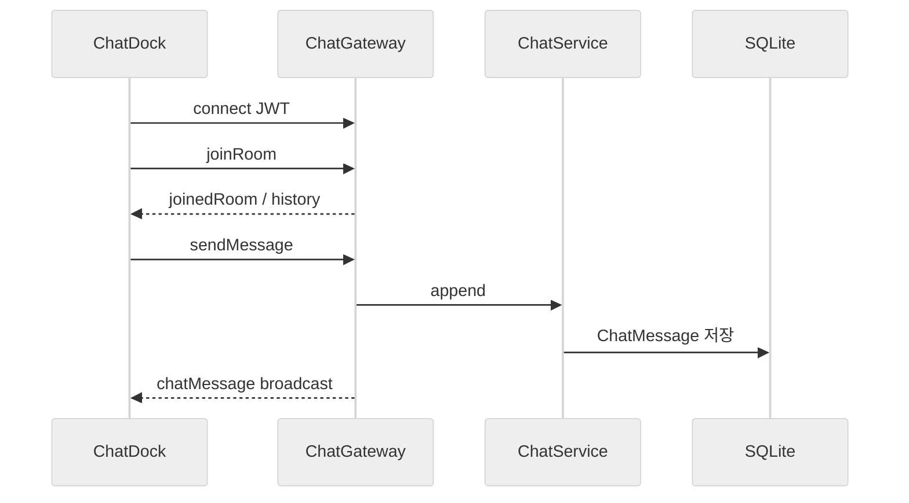
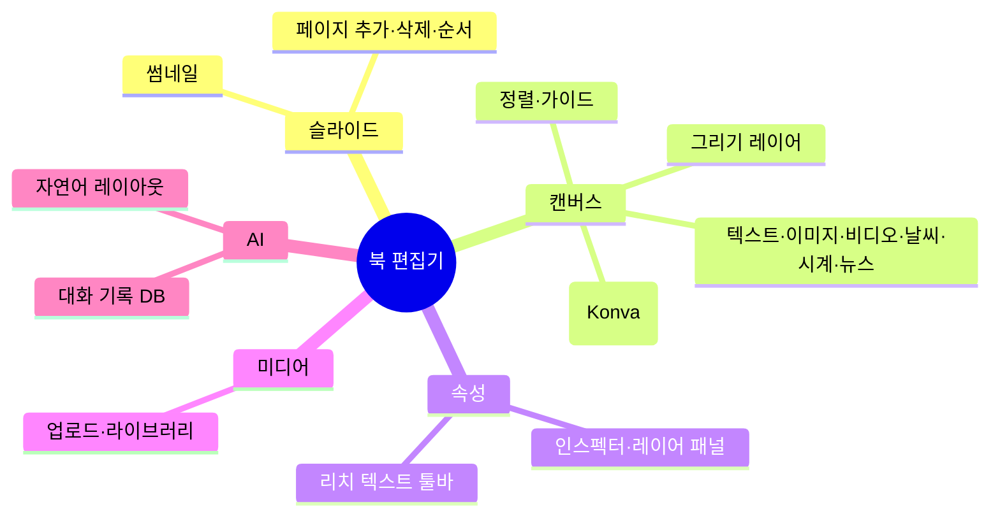

# react-auth 프로젝트 아키텍처 & 기능 가이드

> 백엔드(NestJS) · 프론트엔드(React + Vite) · SQLite(TypeORM) 기반 풀스택 앱의 구조, 엔티티, API, 주요 사용자 흐름을 한곳에 정리한 문서입니다.

**유지보수:** API·라우트·페이징(무한 스크롤 포함)·엔티티 등 이 문서에 대응하는 코드가 바뀌면, 변경과 **같은 작업**에서 이 파일도 수정하거나 필요한 절을 추가한다. 에이전트·기여자용 자동 안내는 `.cursor/rules/docs-architecture-sync.mdc`를 본다.

---

## 목차

1. [한눈에 보기](#1-한눈에-보기)
2. [기술 스택](#2-기술-스택)
3. [시스템 구성도](#3-시스템-구성도)
4. [데이터 모델 (엔티티)](#4-데이터-모델-엔티티)
5. [백엔드 모듈 & API](#5-백엔드-모듈--api)
6. [프론트엔드 라우팅 & 화면](#6-프론트엔드-라우팅--화면)
7. [주요 비즈니스 흐름](#7-주요-비즈니스-흐름)
8. [북(Book) 편집기 심화](#8-북book-편집기-심화)
9. [디렉터리 구조 (요약)](#9-디렉터리-구조-요약)
10. [개발·배포 시 참고](#10-개발배포-시-참고)
11. [역할 기반 접근 제어 (RBAC)](#11-역할-기반-접근-제어-rbac)

---

## 1. 한눈에 보기

| 영역 | 역할 |
|------|------|
| **인증** | 회원가입/로그인, JWT 액세스·리프레시, HttpOnly 쿠키 기반 갱신 |
| **게시글(Posts)** | 목록·상세, 작성/수정(보호), 첨부(이미지·동영상), 좋아요, 댓글(트리) |
| **북(Books)** | 슬라이드형 문서, 캔버스 위젯, 미디어 업로드, **레이아웃 AI**(OpenAI), **AI 대화 DB 저장** |
| **채팅(Chat)** | Socket.IO 네임스페이스 `/chat`, 로비·사용자 방, 메시지 영속화 |
| **날씨** | 위젯용 현재 날씨 API 프록시 |
| **뉴스** | 북 편집기 뉴스 위젯용 [NewsAPI](https://newsapi.org/) 헤드라인 프록시 (`NEWSAPI_KEY`) |
| **Cats** | 학습용 CRUD (`study_cats` 테이블) |
| **사용자** | 내 정보 조회/수정, 아바타 |
| **역할(RBAC)** | `user` / `admin`, DB·JWT·가드·도메인 정책으로 수정·삭제 권한 분리 |

---

## 2. 기술 스택



| 계층 | 기술 |
|------|------|
| UI | React, Tailwind CSS, shadcn/ui 계열 컴포넌트 |
| 빌드 | Vite, TypeScript |
| API 클라이언트 | Axios, `withCredentials` |
| 서버 | NestJS 11, class-validator, Swagger (`/api` 등) |
| DB | SQLite, TypeORM (`synchronize: true` — **개발용**) |
| 실시간 | Socket.IO (`/chat`) |
| 외부 연동 | OpenAI Chat Completions(북 AI), Pexels(이미지·영상 검색), NewsAPI(뉴스 위젯 헤드라인) |

---

## 3. 시스템 구성도



---

## 4. 데이터 모델 (엔티티)

### 4.1 ER 개요



### 4.2 엔티티 요약표

| 엔티티 | 테이블(기본) | 핵심 필드 / 관계 |
|--------|----------------|------------------|
| `User` | `user` | email(유니크), name, password, **role**(`user`\|`admin`), profileImageFilename |
| `RefreshToken` | `refresh_token` | userId, tokenHash(SHA-256), expiresAt |
| `Post` | `post` | title, content, author → User |
| `PostAttachment` | `post_attachment` | postId, kind(image\|video), fileFilename, posterFilename |
| `PostLike` | `post_like` | post + user 유니크 |
| `PostComment` | `post_comment` | post, author, parent(트리) |
| `Book` | `book` | title, slideWidth/Height, author → User |
| `BookPage` | `book_page` | book, sortOrder, slideName, **elementsJson**, backgroundColor, presentationTimingElementId, **presentationTransition**, presentationTransitionMs |
| `BookAiChatMessage` | `book_ai_chat_message` | book → CASCADE, role(user\|assistant), body |
| `ChatRoom` | `chat_room` | roomId(유니크), ownerId |
| `ChatMessage` | `chat_message` | roomId, authorId, body, 인덱스(roomId, createdAt) |
| `Cat` | `study_cats` | name, age, breed |

> **북 캔버스 요소**는 `BookPage.elementsJson`에 JSON 배열로 저장됩니다. 타입·필드 정의는 프론트 `book-canvas.ts` 및 백엔드 `books.service` 검증 로직과 맞춥니다. 요소 `type`에는 `text`·`image`·`video`·위젯류·`drawing`·**`shape`**(파워포인트식 기본 도형 다수 — 둥근 사각·사다리꼴·평행사변형·쉐브론·호·플러스·X 등, Konva)가 포함됩니다. `shape`의 `strokeWidth`는 0~32이며 **0이면 테두리 없음**(면이 있는 도형만 채만 보임; `line`·`arrow`·`cross`는 0이면 화면에 안 보임). 왼쪽 페이지 목록(`BookPageSidebar`) 썸네일은 행(카드) 가로를 꽉 채우고, 세로만 `slideWidth`/`slideHeight` 비율(`aspect-ratio`)로 맞춥니다. 편집기에서 툴레일 오른쪽 탭 열은 `bookLeftDockContentColumnClass(slideWidth, slideHeight)`로 **명시 폭**(기준 11·17·20rem의 `calc(*2/3)`에 공통 **×1.12**, `min(..., 100vw-5rem)`); 가로가 더 긴 해상도는 추가로 **×1.18**(대략 합 **×1.322**). 세로형·정사각은 동일 기준 폭. 공개 보기 등(비-fluid) 페이지 패널은 `BookPageSidebar` 고정 `w-*`(약 20rem / sm 24rem).

---

## 5. 백엔드 모듈 & API

### 5.1 모듈 맵



### 5.2 HTTP API 요약

**인증** — `@Controller('auth')`

| 메서드 | 경로 | 설명 |
|--------|------|------|
| POST | `/auth/signup` | 회원가입 |
| POST | `/auth/signin` | 로그인(쿠키 설정) |
| POST | `/auth/refresh` | 액세스 토큰 갱신 |
| POST | `/auth/logout` | 로그아웃 |

**사용자** — JWT 필요 구간 있음

| 메서드 | 경로 | 설명 |
|--------|------|------|
| GET | `/users/me` | 내 프로필(역할·아바타 URL 포함) |
| PATCH | `/users/me` | 내 정보 수정(multipart). 역할: 본인을 `admin`으로 올리기 불가, 관리자는 본인을 `user`로 강등 가능(마지막 관리자는 불가) |
| GET | `/users/admin` | **관리자만** — 전체 사용자 목록(역할·아바타 URL 등, 비밀번호 없음) |
| POST | `/users/admin/set-role` | **관리자만** — JSON `{ email, role }`로 타 계정 역할 저장 |

**게시글** — `@Controller('posts')`

| 메서드 | 경로 | 설명 |
|--------|------|------|
| GET | `/posts` | 목록(**커서**·`cursor`/`nextCursor`/`hasMore`), Bearer 시 likedByMe; 첫 응답에만 `total` |
| GET | `/posts/:id` | 상세 |
| GET | `/posts/:id/comments` | 댓글 트리 |
| POST | `/posts/:id/like` | 좋아요 (JWT) |
| DELETE | `/posts/:id/like` | 좋아요 취소 (JWT) |
| POST | `/posts/:id/comments` | 댓글 작성 (JWT) |
| DELETE | `/posts/:id/comments/:commentId` | 댓글 삭제 (JWT) |
| PATCH | `/posts/:id` | 수정 (JWT) |
| DELETE | `/posts/:id` | 삭제 (JWT) |

**북** — `@Controller('books')`

| 메서드 | 경로 | 설명 |
|--------|------|------|
| GET | `/books` | 목록(페이지·검색) |
| GET | `/books/:id` | 상세(페이지·요소) |
| POST | `/books` | 생성 (JWT) |
| PATCH | `/books/:id` | 수정 (작성자, JWT) |
| DELETE | `/books/:id` | 삭제 (작성자, JWT) |
| POST | `/books/:id/upload` | 이미지/동영상 업로드 (JWT) |

**북 AI** — `@Controller('books/ai')` (전역 JWT)

| 메서드 | 경로 | 설명 |
|--------|------|------|
| GET | `/books/ai/chat?bookId=` | 해당 북 AI 대화 기록(작성자, 최대 200줄) |
| POST | `/books/ai/layout` | 자연어 → 레이아웃 JSON 액션(OpenAI). `bookId` 선택 시 **성공 턴**을 DB에 저장 |

**기타**

| 컨트롤러 | 대표 엔드포인트 |
|----------|-----------------|
| `WeatherController` | `GET /weather/current`, `GET /weather/seoul` |
| `NewsController` | `GET /news/headlines` — 쿼리 `country`, 선택 `category`, `pageSize`(1–10); 서버 `NEWSAPI_KEY` 필요 |
| `CatsController` | `GET/POST/PATCH/DELETE /cats`, `GET /cats/:id`, 이미지 업로드 등 |
| `AppController` | `GET /` 헬스 등 |

#### 5.2.1 Cats study 모듈 — HTTP 요청 생명주기

학습용 `CatsModule`은 Nest **미들웨어 → 가드 → 인터셉터 → 파이프 → 컨트롤러 → 서비스 → TypeORM Repository** 순(및 예외 시 **Exception Filter**)을 로그와 코드로 따라갈 수 있게 짜여 있습니다. 표·다이어그램·공식 문서 링크는 백엔드 **`backend/src/cats/REQUEST_FLOW.md`** 에 모아 두었고, `cats.module.ts` 주석에도 요약이 있습니다.

- **Guard만 따로 보기:** `GET /cats/_study/guard-sample` — 헤더 `x-cats-study: yes` 필요(없으면 401).

> HTTP API는 기본적으로 **루트 경로**에 마운트됩니다. Swagger UI: **`/api-docs`** (포트는 `backend` 설정 참고).

### 5.3 WebSocket 채팅

- 네임스페이스: **`/chat`**
- 클라이언트: `io(apiOrigin + '/chat', { path: '/socket.io', auth: { token } })`
- 주요 이벤트(개념): 방 입장/퇴장, 메시지 전송, 히스토리 로드, 방 목록 등 (`ChatGateway`, `ChatDock.tsx` 참고)

---

## 6. 프론트엔드 라우팅 & 화면

### 6.1 라우트 다이어그램



| 경로 | 페이지 | 비고 |
|------|--------|------|
| `/` | `HomePage` | 랜딩 |
| `/login`, `/signup` | 로그인·가입 | |
| `/posts` | `PostListPage` | 무한 스크롤·**커서 API** (아래 **6.3절** 참고) |
| `/posts/:id` | `PostDetailPage` | 공개 |
| `/posts/new`, `/posts/:id/edit` | `PostEditorPage` | 로그인 필요 |
| `/books` | `BookListPage` | 무한 스크롤 UI이나 API는 **`skip`/`take`/`total`** (6.3절) |
| `/books/new` | `BookEditorPage` | 로그인 필요, 저장 후 상세로 이동 가능 |
| `/books/:id` | `BookDetailPage` | 공개 URL; 작성자면 편집 UI, 비작성자는 보기·레이어 패널·**미리보기(슬라이드쇼)** |
| `/books/:id/preview` | `BookPresentationPage` | 공개; 헤더 아래 북 스테이지는 **바깥 CSS·맞춤 패딩 없이** 가장자리까지 사용. 창 미리보기와 **브라우저 전체 화면**(슬라이드 영역만 `requestFullscreen`)이 **동일한 표시 모드**(헤더 토글: 전체/contain·덮기/cover·꽉/fill; 줌 **초기**는 배율·줌 리셋). 전체 화면 즉시 진입·Esc 종료; 슬라이드 영역은 **진입 직후** 커서·**비디오·미디어 바** 숨김, 짧은 **포인터 유예(ms)** 뒤 실제 움직임에서만 다시 표시 후 유휴 시 재숨김(`book-pres-fs-hide-cursor`·`viewModeHideMediaChrome`·`PRESENTATION_FULLSCREEN_POINTER_GRACE_MS`). **전환 효과**·`BOOK_CANVAS_PRESENTATION_DISPLAY_OPTS`·줌 — 편집 스테이지는 `BOOK_CANVAS_STAGE_DISPLAY_OPTS`(contain·옵션 맞춤 패딩 0) + 래퍼 **얇은 CSS 패딩**(`p-2`, `ResizeObserver`가 반영); 좌우 패널 접기 시 중앙 열 리사이즈로 맞춤 재계산, 맞춤 버튼은 줌 1 + 재측정 |
| `/books/:id/edit` | → `/books/:id` 리다이렉트 | 레거시 |
| `/me` | `MyInfoPage` | |
| `/cats`, `/cats/:id` | Cats 데모 | |

### 6.2 공통 UI

- `AppLayout`: 루트를 **`h-dvh`·`overflow-hidden` flex 열**로 두어 헤더·**컴팩트 푸터**가 뷰포트에 고정되고, 스크롤은 **`#site-app-main-scroll` `<main>`** 안에서만 일어난다(홈·북 셸은 `main`이 `overflow-hidden`이고 내부가 스크롤). 글·북 목록 무한 스크롤은 `window` 대신 이 `main`의 `scrollTop`·`scrollHeight`를 쓴다(`app-layout-scroll.ts`). 헤더·**컴팩트 푸터**(얇은 세로 패딩)·채팅 독(`ChatDock`) 등 껍데기. **`/books/:id`(숫자 id만, 상세)** 에서만 사이트 **헤더·푸터 접기/펼치기** 토글·`localStorage` 동기화(`bookDetailChromeRoute`, 키 미설정 시 기본 **접힘**·`"0"`만 펼침); **`/books/new`·그 외 라우트**에서는 사이트 헤더·푸터 **항상 표시**·토글 없음. 북 워크스페이스 **레이아웃**(넓은 main·`h-dvh` 체인)은 기존처럼 **`/books/new` 포함** `bookShellRoute`. **펼친 상태** 토글 위치: 헤더 **로그아웃(비로그인 시 회원가입) 바로 옆**, 푸터 내비 **내 정보(비로그인 시 회원가입) 바로 옆**(`max-w-3xl` 열 안). **접힘** 시 **보이는 건 토글 버튼만**(헤더·푸터 막대·배경 없음). `fixed` 투명 래퍼(`…CollapsedStrip*`)는 펼친 때와 **같은 세로·가로 착지**만 맞추고 `pointer-events-none`이라 그 밑 북 UI는 그대로 조작된다 — 버튼만 `floatingDockBookSiteChromeToggleClass`에 `pointer-events-auto`. 헤더: `top-0`·`h-12`·`items-center`·`justify-end` 열; 푸터: `bottom-0`·`px-4 py-2 sm:py-2.5`. `size="icon-sm"`은 로그아웃 `sm`과 같은 `h-7`/`w-7`. 헤더 `z-[260]`은 `BookWorkspaceShell`(`z-[250]`) 위. 상태는 `localStorage` `book-workspace-chrome-header-collapsed` / `book-workspace-chrome-footer-collapsed`. 플로팅 채팅(`ChatDock`)·북 AI FAB는 `floating-dock-chrome.ts`에서 **좌우 미러 인셋**(`start-4`·`end-4`, sm `7`)·**동일 하단**·버튼·아이콘 크기를 맞추고, `bottom`은 컴팩트 푸터 안쪽에 가깝게 잡음. `ChatDock`은 `flex-1` 정렬 래퍼를 `pointer-events-none`으로 두고 **열린 패널·닫힌 FAB만** `pointer-events-auto` — 그렇지 않으면 오른쪽 가늘 띠 전체가 히트 영역이 되어 북 속성 패널이 가려진 것처럼 동작할 수 있음. 북 AI FAB는 패널 **닫힌 상태**에서만 `index.css`의 `book-ai-fab-attention`(이중 펄스·글로우, `prefers-reduced-motion` 시 비활성)으로 시선 유도
- 북 워크스페이스 `book-workspace-ui.ts`: 속성·레이어·**페이지**(`BookPageSidebar`) 제목 행과 가운데 **캔버스 툴바 행**을 같은 **`h-12` 헤더 밴드**로 맞춤 — `AppLayout` 사이트 헤더·`BookWorkspaceShell` 제목 줄(`h-12`·`px-4`)과 동일 높이(`bookDockedPanelHeaderRowClass` / `bookCanvasToolbarRowClass`). 오른쪽 독은 **`BookLayersPanel`**이 음영(`muted`) 배경·**아래 `border-b-2`**, 그 아래 페이지·위젯 속성 래퍼는 **`bookRightDockInspectorShellClass`**(`card` 톤)로 레이어 블록과 구분
- `ProtectedRoute`: 비로그인 시 로그인으로 이동
- API 래퍼: `frontend/src/lib/api.ts` (토큰·에러 처리)

### 6.3 공부용: 무한 스크롤·목록 페이징 (posts만 방식이 다름)

같은 “아래로 스크롤하면 더 불러오기” UX라도, **백엔드 페이징 모델은 글(posts)만 커서 기반**으로 구현해 두었습니다. 나머지는 비교·학습용으로 다른 패턴을 그대로 둡니다.

| 구분 | 화면 | 프론트 | 백엔드 목록 API |
|------|------|--------|-----------------|
| **글** | `PostListPage` | `useInfiniteQuery`, `pageParam` = 이전 응답의 **`nextCursor`** 문자열(첫 요청은 생략) | `GET /posts?take=&search=&cursor=` — **`cursor` / `nextCursor` / `hasMore`**, 정렬 `createdAt DESC`, `id DESC`로 안정적 이어붙임. **`total`은 cursor 없는 첫 응답에만** 포함 |
| 북 | `BookListPage` | `useInfiniteQuery`, `pageParam` = 지금까지 로드한 개수(**오프셋 `skip`**) | `GET /books?skip=&take=` … **`skip`·`take`·`total`** 전통적 페이지네이션 |
| 캣츠 | `CatsPage` | `useQuery`로 **목록 전체 한 번** 로드 | `GET /cats` 전체(데모 규모 가정) |

정리하면, **무한 스크롤 “데이터 이어붙이기” 구현을 커서 방식으로 쓰는 곳은 posts 뿐**이고, books는 오프셋+`total`로 다음 페이지를 잡습니다. 실무에서는 데이터가 커지면 북 목록도 커서로 바꾸는 선택지가 있습니다.

---

## 7. 주요 비즈니스 흐름

### 7.1 로그인 & API 호출 (개념)



### 7.2 북 저장 흐름



### 7.3 북 레이아웃 AI + 대화 저장



> OpenAI 요청에 **이전 대화를 넣지 않으므로**, DB에 기록만 해도 **토큰 사용량은 늘지 않습니다.** (향후 “기억”을 모델에 넣으면 그때 입력 토큰이 증가합니다.)

시스템 프롬프트에는 `backend/src/books/book-ai-user-guide.ts`에 정리한 **사실 기반 사용자 가이드**(지원 미디어 MIME·용량, `/preview`, 전환·템플릿, 위젯 종류, AI가 할 수 있는 액션 한계 등)가 포함되어, “지원 포맷이 뭐야?” 같은 **기능 문의**에도 한국어로 답할 수 있게 한다. 레이아웃 AI의 `add_widget`은 선택적으로 **x, y, width, height**(슬라이드 논리 px)를 받아 격자·**강의 시간표**·**디지털 사이니지**(메뉴보드·공지·프로모 등)처럼 여러 텍스트·이미지·시계·날씨 위젯을 한 화면에 구성할 수 있다. 가이드·프롬프트 내용은 제품과 어긋나면 안 되므로 스펙 변경 시 해당 파일을 함께 수정한다.

### 7.4 채팅(WebSocket)



---

## 8. 북(Book) 편집기 심화

### 8.1 기능 맵 (개념)



### 8.2 프론트 주요 파일 (참고용)

| 구역 | 대표 경로 |
|------|-----------|
| 상세·편집 통합 | `pages/BookDetailPage.tsx` |
| 신규 북 | `pages/BookEditorPage.tsx` |
| 슬라이드 캔버스 | `components/books/BookSlideCanvas.tsx` |
| Elements(도형) 패널 | `components/books/BookElementsPanel.tsx` — 왼쪽 툴레일 **Elements** 탭; 위젯 팔레트와 같이 **슬라이드로 드래그**해 놓거나 클릭해 가운데 추가 (`BOOK_SHAPE_DRAG_TYPE` / `onDropShape`) |
| AI 패널 | `components/books/BookAiAssistantPanel.tsx` |
| 캔버스 타입·도구 | `lib/book-canvas.ts`, `lib/book-text-widget.ts` |
| 슬라이드 템플릿(사이니지) | `lib/book-slide-templates.ts` — 카테고리: 메뉴·공지·**실생활**·뉴스·비주얼 |
| 슬라이드쇼 전환 | `lib/book-presentation-transition.ts`, `book-presentation-transitions.css` |
| AI 배치 해석 | `lib/book-ai-placement.ts` |

백엔드 레이아웃 AI 시스템 프롬프트·가이드 문구: `backend/src/books/book-ai.service.ts`, `backend/src/books/book-ai-user-guide.ts`.

---

## 9. 디렉터리 구조 (요약)

```
react-auth/
├── backend/                 # NestJS
│   └── src/
│       ├── auth/
│       ├── books/           # Book, BookPage, AI, Pexels, 업로드
│       ├── chat/
│       ├── posts/
│       ├── users/
│       ├── weather/
│       ├── news/            # NewsAPI 헤드라인 프록시
│       ├── cats/            # 학습용 CRUD + REQUEST_FLOW.md(요청 생명주기 문서)
│       └── main.ts
├── frontend/                # Vite + React
│   └── src/
│       ├── pages/
│       ├── components/
│       ├── lib/             # api, book-*, query-keys …
│       └── App.tsx
└── docs/
    └── PROJECT_ARCHITECTURE.md   # 본 문서
```

---

## 10. 개발·배포 시 참고

| 항목 | 내용 |
|------|------|
| DB 스키마 | `app.module.ts`에서 `synchronize: true` — **운영에서는 마이그레이션 + synchronize 끄기 권장** |
| 비밀 값 | `backend/.env`, `frontend/.env` — 예시는 각 `.env.example` |
| 북 AI | `OPENAI_API_KEY`, 선택 `OPENAI_MODEL`; Pexels 키는 서버 설정에 따름 |
| 뉴스 위젯 | `NEWSAPI_KEY` — [NewsAPI](https://newsapi.org/) 개발자 키 |
| 정적·업로드 | `uploads/` 아바타·북 미디어·글 첨부 등 |
| 글 시드(개발) | `backend`에서 `npm run seed:posts` — 가장 오래된 사용자에게 IT 주제 글 20개 삽입(무한 스크롤 테스트용). **재실행 시 20개씩 추가** |
| 최초 관리자 | `BOOTSTRAP_ADMIN_EMAILS`(쉼표 구분) 또는 DB에서 `role = 'admin'` 직접 설정 후, 이후에는 관리자 UI/API로 역할 관리 |

---

## 11. 역할 기반 접근 제어 (RBAC)

> **학습용 요약:** “로그인했는가?”는 **인증(Authentication)** 이고, “이 글을 지울 수 있는가?”는 **인가(Authorization)** 입니다. 이 프로젝트는 역할이 **`user`(일반)** 과 **`admin`(관리자)** 두 가지이며, **진짜 권한은 DB의 `User.role`** 에 두고, 요청마다 JWT 검증 후 DB에서 다시 읽어 맞춥니다.

### 11.1 역할 정의와 저장

역할은 문자열 enum으로 고정합니다.

```typescript
// backend/src/users/user-role.ts
export enum UserRole {
  User = 'user',
  Admin = 'admin',
}
```

`User` 엔티티에 컬럼으로 저장됩니다(기본값 일반 사용자).

```typescript
// backend/src/users/user.entity.ts (발췌)
@Column({ type: 'varchar', length: 16, default: UserRole.User })
role: UserRole;
```

### 11.2 JWT와 “매 요청마다 DB 역할”

액세스 토큰 payload 형식은 다음과 같습니다.

```typescript
// backend/src/auth/types/jwt-payload.type.ts
export interface JwtPayload {
  sub: number;
  email: string;
  name: string;
  role: UserRole;
}
```

로그인·리프레시 시 토큰에 `role`을 넣지만, **Passport JWT 전략의 `validate`에서는 DB를 다시 조회**해 `req.user`를 채웁니다. 그래서 DB에서 관리자로 올린 뒤에는 **재로그인 없이도** 다음 요청부터 관리자 권한이 반영됩니다(토큰 안의 role과 잠시 어긋날 수 있어도 `validate` 결과가 우선).

```typescript
// backend/src/auth/jwt.strategy.ts (핵심만)
async validate(payload: JwtPayload): Promise<JwtPayload> {
  const sub = assertJwtSubToUserId(payload.sub);
  const user = await this.usersService.findByIdForAuth(sub);
  if (!user) throw new UnauthorizedException();
  return {
    sub: user.id,
    email: user.email,
    name: user.name ?? '',
    role: user.role ?? UserRole.User,
  };
}
```

### 11.3 라우트 보호: `JwtAuthGuard` + `RolesGuard`

- **`JwtAuthGuard`**: Bearer JWT 검증 후 `validate` 결과를 `req.user`에 붙입니다.
- **`RolesGuard`**: 핸들러에 붙은 `@Roles(...)` 메타데이터를 읽고, `req.user.role`이 허용 목록에 없으면 **403**입니다.

```typescript
// backend/src/auth/roles.decorator.ts
export const ROLES_KEY = 'roles';
export const Roles = (...roles: UserRole[]) => SetMetadata(ROLES_KEY, roles);
```

```typescript
// backend/src/auth/roles.guard.ts (핵심만)
canActivate(context: ExecutionContext): boolean {
  const required = this.reflector.getAllAndOverride<UserRole[]>(ROLES_KEY, [
    context.getHandler(),
    context.getClass(),
  ]);
  if (!required?.length) return true;

  const req = context.switchToHttp().getRequest<{ user?: JwtPayload }>();
  const user = req.user;
  if (!user || !required.includes(user.role)) {
    throw new ForbiddenException('이 작업은 관리자만 할 수 있습니다.');
  }
  return true;
}
```

관리자 전용 사용자 API 예시:

```typescript
// backend/src/users/users.controller.ts (패턴 발췌)
@UseGuards(JwtAuthGuard, RolesGuard)
@Roles(UserRole.Admin)
@Get('admin')
async adminListUsers() {
  return this.usersService.listUsersForAdmin();
}

@UseGuards(JwtAuthGuard, RolesGuard)
@Roles(UserRole.Admin)
@Post('admin/set-role')
async adminSetRole(@Body() body: AdminSetRoleDto) {
  return this.usersService.setRoleByEmail(body.email ?? '', body.role);
}
```

`RolesGuard`는 `AuthModule`에서 `providers`/`exports` 되고, `UsersModule`이 `AuthModule`을 import 하면 컨트롤러에서 사용할 수 있습니다.

### 11.4 도메인 정책: 작성자 vs 관리자

HTTP 라우트마다 “관리자만”을 거는 대신, **글·북·댓글·캣** 등에서는 “소유자이거나 관리자” 같은 공통 규칙을 함수로 둡니다.

```typescript
// backend/src/auth/auth-policy.ts
export type AuthActor = { id: number; role: UserRole };

export function isAdminRole(role: UserRole): boolean {
  return role === UserRole.Admin;
}

export function canMutateOwnedResource(
  actor: AuthActor,
  ownerUserId: number,
): boolean {
  return (
    isAdminRole(actor.role) || Number(actor.id) === Number(ownerUserId)
  );
}

/** Cats: owner 가 없는 레거시 행은 일반 사용자는 수정·삭제 불가 */
export function canMutateCatResource(
  actor: AuthActor,
  ownerUserId: number | null | undefined,
): boolean {
  if (isAdminRole(actor.role)) return true;
  if (ownerUserId == null) return false;
  return Number(actor.id) === Number(ownerUserId);
}
```

각 서비스/컨트롤러는 `req.user.sub`·`req.user.role`로 `AuthActor`를 만들고 위 함수로 수정·삭제 여부를 판단합니다.

### 11.5 관리자 역할 변경과 안전장치

- **`POST /users/admin/set-role`**: 이메일로 대상 사용자를 찾아 `role`을 DB에 저장.
- **`PATCH /users/me`**: 본인이 스스로 **`admin`으로 승격하는 것은 금지**(다른 관리자가 지정). 관리자는 본인을 `user`로 내릴 수 있으나, **시스템에 관리자가 한 명뿐일 때 강등은 거절**합니다(`UsersService`의 `assertNotLastAdminWhenDemotingAdmin`).
- **`BOOTSTRAP_ADMIN_EMAILS`**: 부팅 시 해당 이메일(들)을 `admin`으로 맞추는 **선택 시드**. 비우면 동작하지 않음. 상수는 `backend/src/env.constants.ts`의 `BOOTSTRAP_ADMIN_EMAILS` 참고.

### 11.6 프론트엔드

- **`AuthUser.role`**: `GET /users/me` 응답에 포함(`frontend/src/lib/api.ts`).
- **`authz` 헬퍼**: UI에서 버튼 노출·편집 가능 여부를 맞출 때 사용합니다.

```typescript
// frontend/src/lib/authz.ts
export function isAdminUser(user: AuthUser | null | undefined): boolean {
  return user?.role === "admin";
}

export function canEditAsOwnerOrAdmin(
  user: AuthUser | null,
  authorId: number,
): boolean {
  if (!user) return false;
  if (isAdminUser(user)) return true;
  return Number(user.sub) === Number(authorId);
}
```

- **내 정보 화면**: 관리자에게만 “다른 사용자 역할” 목록(`GET /users/admin`)·행별 저장(`POST /users/admin/set-role`)을 노출합니다(`MyInfoPage.tsx`).

### 11.7 학습 시 따라가기 좋은 파일 목록

| 구분 | 경로 |
|------|------|
| 역할 enum | `backend/src/users/user-role.ts` |
| DB 필드 | `backend/src/users/user.entity.ts` |
| JWT payload·전략 | `backend/src/auth/types/jwt-payload.type.ts`, `jwt.strategy.ts` |
| 가드·데코레이터 | `backend/src/auth/roles.guard.ts`, `roles.decorator.ts`, `jwt.guard.ts` |
| 소유자/관리자 판별 | `backend/src/auth/auth-policy.ts` |
| 관리자 API·내 프로필 | `backend/src/users/users.controller.ts`, `users.service.ts` |
| 프론트 권한 헬퍼 | `frontend/src/lib/authz.ts` |
| 관리자 UI | `frontend/src/pages/MyInfoPage.tsx` |

---

### 문서 버전

- 저장소: **react-auth**
- 생성 기준: 코드 트리의 모듈·엔티티·라우트·주요 컴포넌트를 반영한 개요 문서입니다. 세부 DTO·쿼리 파라미터는 **Swagger**와 각 `*.controller.ts`를 함께 보시면 가장 정확합니다.
