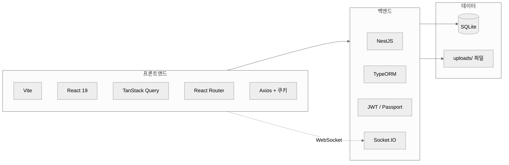
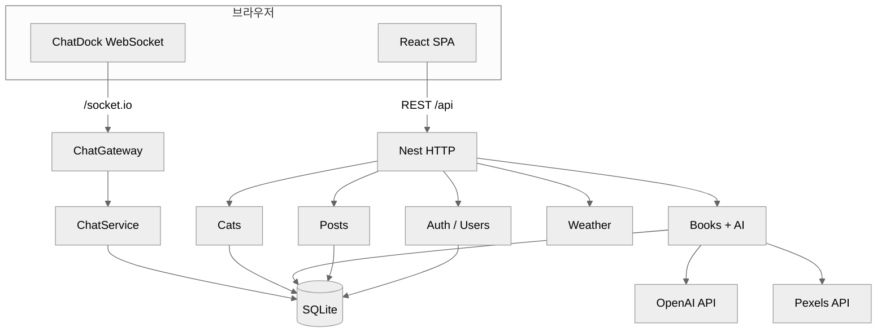
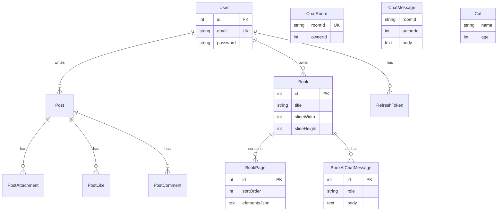
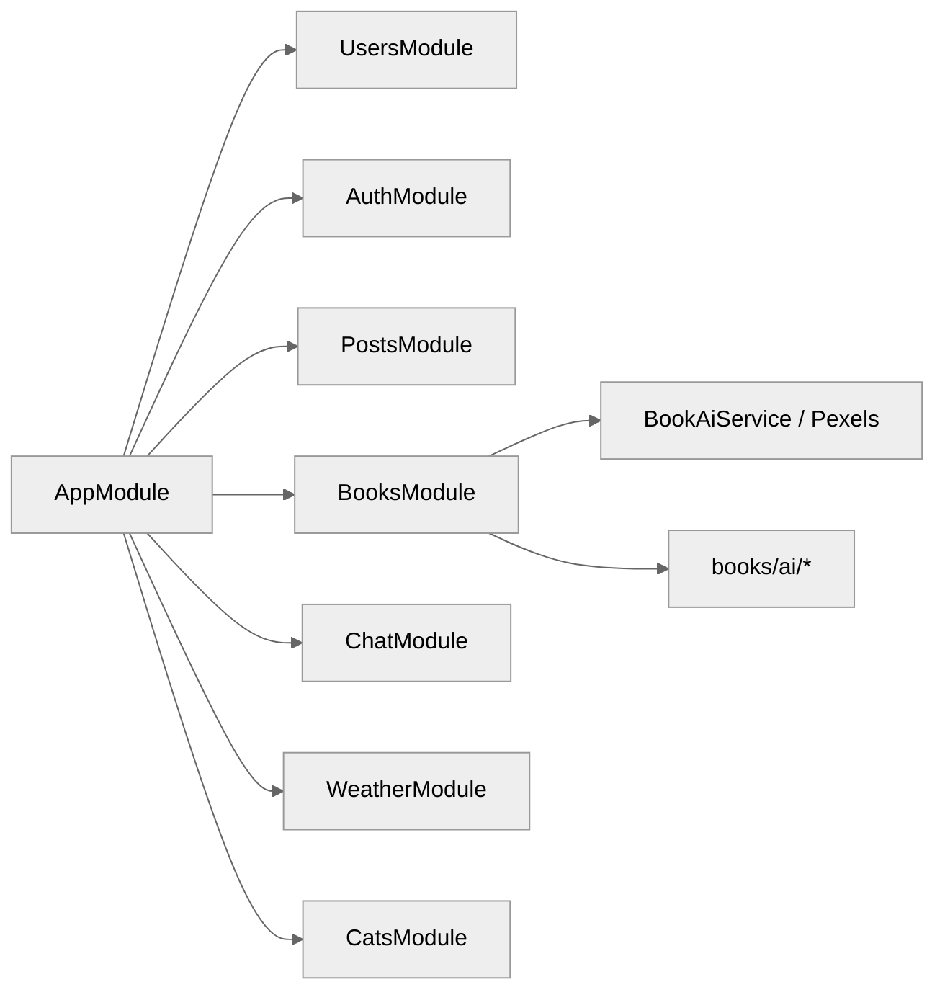
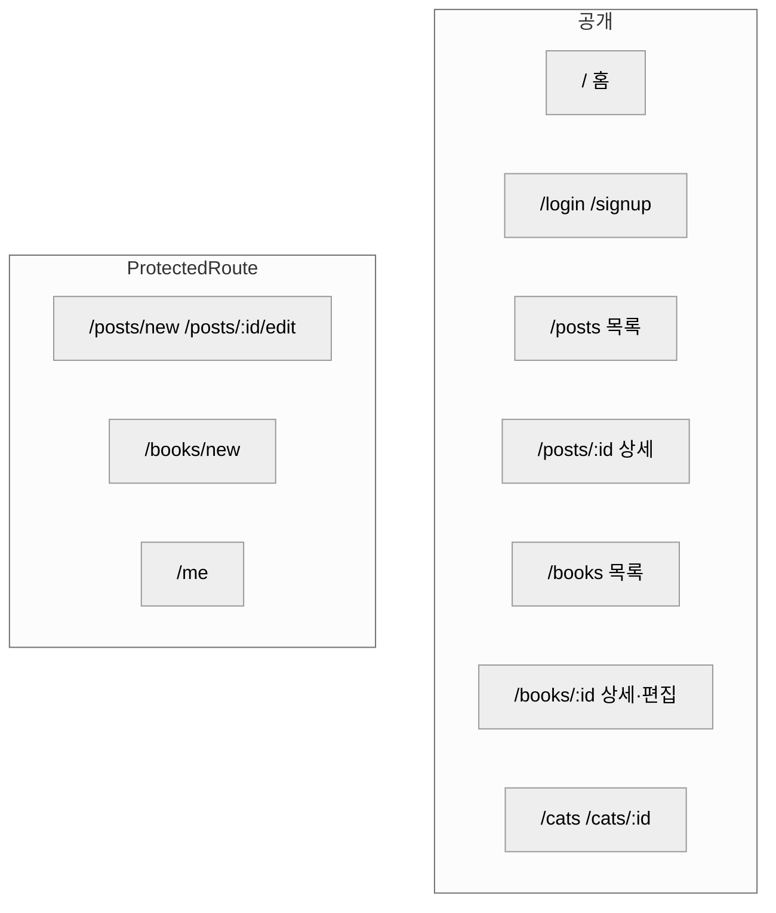
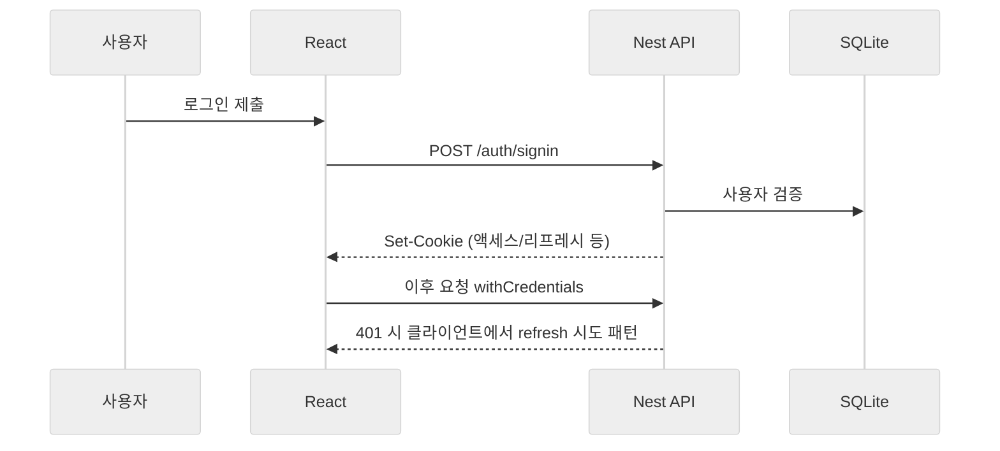
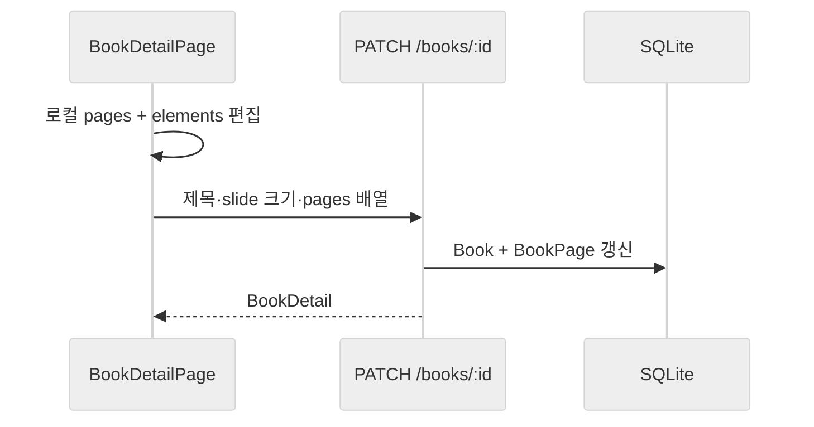
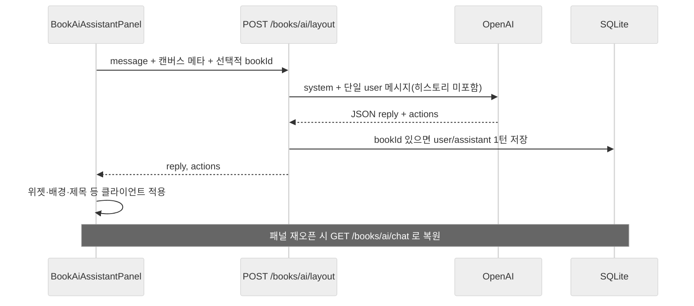
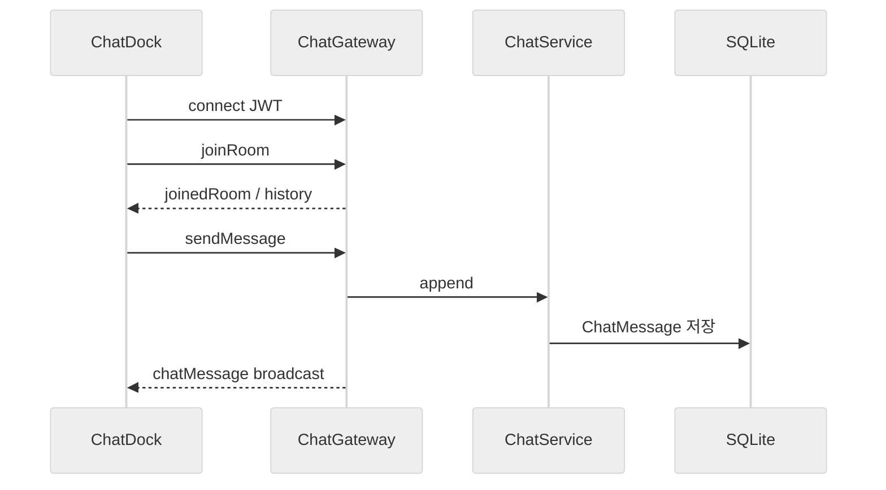
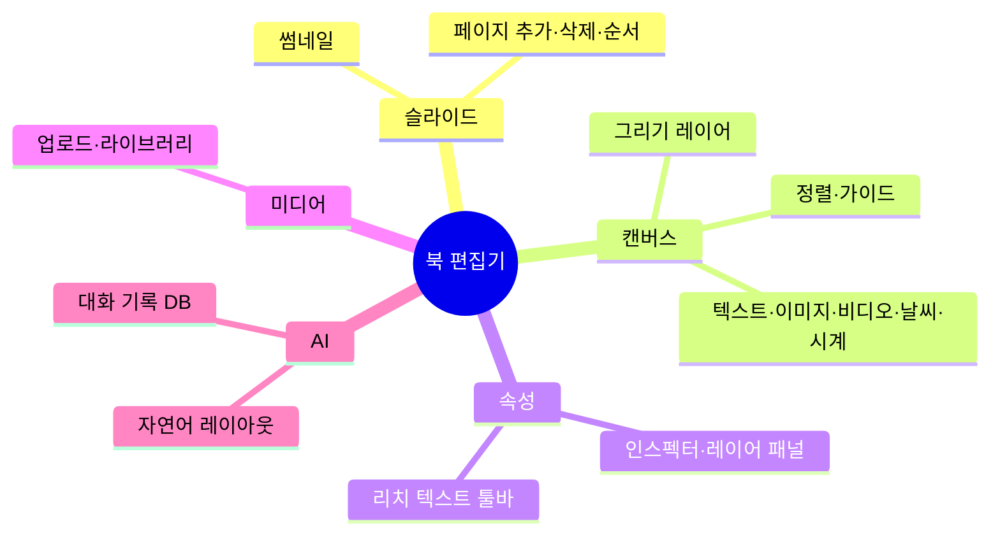

# react-auth 프로젝트 아키텍처 & 기능 가이드

> 백엔드(NestJS) · 프론트엔드(React + Vite) · SQLite(TypeORM) 기반 풀스택 앱의 구조, 엔티티, API, 주요 사용자 흐름을 한곳에 정리한 문서입니다.

---

## 목차

1. [한눈에 보기](#1-한눈에-보기)
2. [기술 스택](#2-기술-스택)
3. [시스템 구성도](#3-시스템-구성도)
4. [데이터 모델 (엔티티)](#4-데이터-모델-엔티티)
5. [백엔드 모듈 & API](#5-백엔드-모듈--api)
6. [프론트엔드 라우팅 & 화면](#6-프론트엔드-라우팅--화면)
7. [주요 비즈니스 흐름](#7-주요-비즈니스-흐름)
8. [북(Book) 편집기 심화](#8-북book-편집기-심화)
9. [디렉터리 구조 (요약)](#9-디렉터리-구조-요약)
10. [개발·배포 시 참고](#10-개발배포-시-참고)

---

## 1. 한눈에 보기

| 영역 | 역할 |
|------|------|
| **인증** | 회원가입/로그인, JWT 액세스·리프레시, HttpOnly 쿠키 기반 갱신 |
| **게시글(Posts)** | 목록·상세, 작성/수정(보호), 첨부(이미지·동영상), 좋아요, 댓글(트리) |
| **북(Books)** | 슬라이드형 문서, 캔버스 위젯, 미디어 업로드, **레이아웃 AI**(OpenAI), **AI 대화 DB 저장** |
| **채팅(Chat)** | Socket.IO 네임스페이스 `/chat`, 로비·사용자 방, 메시지 영속화 |
| **날씨** | 위젯용 현재 날씨 API 프록시 |
| **Cats** | 학습용 CRUD (`study_cats` 테이블) |
| **사용자** | 내 정보 조회/수정, 아바타 |

---

## 2. 기술 스택



| 계층 | 기술 |
|------|------|
| UI | React, Tailwind CSS, shadcn/ui 계열 컴포넌트 |
| 빌드 | Vite, TypeScript |
| API 클라이언트 | Axios, `withCredentials` |
| 서버 | NestJS 11, class-validator, Swagger (`/api` 등) |
| DB | SQLite, TypeORM (`synchronize: true` — **개발용**) |
| 실시간 | Socket.IO (`/chat`) |
| 외부 연동 | OpenAI Chat Completions(북 AI), Pexels(이미지·영상 검색) |

---

## 3. 시스템 구성도



---

## 4. 데이터 모델 (엔티티)

### 4.1 ER 개요



### 4.2 엔티티 요약표

| 엔티티 | 테이블(기본) | 핵심 필드 / 관계 |
|--------|----------------|------------------|
| `User` | `user` | email(유니크), name, password, profileImageFilename |
| `RefreshToken` | `refresh_token` | userId, tokenHash(SHA-256), expiresAt |
| `Post` | `post` | title, content, author → User |
| `PostAttachment` | `post_attachment` | postId, kind(image\|video), fileFilename, posterFilename |
| `PostLike` | `post_like` | post + user 유니크 |
| `PostComment` | `post_comment` | post, author, parent(트리) |
| `Book` | `book` | title, slideWidth/Height, author → User |
| `BookPage` | `book_page` | book, sortOrder, slideName, **elementsJson**, backgroundColor |
| `BookAiChatMessage` | `book_ai_chat_message` | book → CASCADE, role(user\|assistant), body |
| `ChatRoom` | `chat_room` | roomId(유니크), ownerId |
| `ChatMessage` | `chat_message` | roomId, authorId, body, 인덱스(roomId, createdAt) |
| `Cat` | `study_cats` | name, age, breed |

> **북 캔버스 요소**는 `BookPage.elementsJson`에 JSON 배열로 저장됩니다. 타입·필드 정의는 프론트 `book-canvas.ts` 및 백엔드 `books.service` 검증 로직과 맞춥니다.

---

## 5. 백엔드 모듈 & API

### 5.1 모듈 맵



### 5.2 HTTP API 요약

**인증** — `@Controller('auth')`

| 메서드 | 경로 | 설명 |
|--------|------|------|
| POST | `/auth/signup` | 회원가입 |
| POST | `/auth/signin` | 로그인(쿠키 설정) |
| POST | `/auth/refresh` | 액세스 토큰 갱신 |
| POST | `/auth/logout` | 로그아웃 |

**사용자** — JWT 필요 구간 있음

| 메서드 | 경로 | 설명 |
|--------|------|------|
| GET | `/users/me` | 내 프로필 |
| PATCH | `/users/me` | 내 정보 수정 |

**게시글** — `@Controller('posts')`

| 메서드 | 경로 | 설명 |
|--------|------|------|
| GET | `/posts` | 목록(페이지), Bearer 시 likedByMe |
| GET | `/posts/:id` | 상세 |
| GET | `/posts/:id/comments` | 댓글 트리 |
| POST | `/posts/:id/like` | 좋아요 (JWT) |
| DELETE | `/posts/:id/like` | 좋아요 취소 (JWT) |
| POST | `/posts/:id/comments` | 댓글 작성 (JWT) |
| DELETE | `/posts/:id/comments/:commentId` | 댓글 삭제 (JWT) |
| PATCH | `/posts/:id` | 수정 (JWT) |
| DELETE | `/posts/:id` | 삭제 (JWT) |

**북** — `@Controller('books')`

| 메서드 | 경로 | 설명 |
|--------|------|------|
| GET | `/books` | 목록(페이지·검색) |
| GET | `/books/:id` | 상세(페이지·요소) |
| POST | `/books` | 생성 (JWT) |
| PATCH | `/books/:id` | 수정 (작성자, JWT) |
| DELETE | `/books/:id` | 삭제 (작성자, JWT) |
| POST | `/books/:id/upload` | 이미지/동영상 업로드 (JWT) |

**북 AI** — `@Controller('books/ai')` (전역 JWT)

| 메서드 | 경로 | 설명 |
|--------|------|------|
| GET | `/books/ai/chat?bookId=` | 해당 북 AI 대화 기록(작성자, 최대 200줄) |
| POST | `/books/ai/layout` | 자연어 → 레이아웃 JSON 액션(OpenAI). `bookId` 선택 시 **성공 턴**을 DB에 저장 |

**기타**

| 컨트롤러 | 대표 엔드포인트 |
|----------|-----------------|
| `WeatherController` | `GET /weather/current`, `GET /weather/seoul` |
| `CatsController` | `GET/POST/DELETE /cats`, `GET /cats/:id` |
| `AppController` | `GET /` 헬스 등 |

> HTTP API는 기본적으로 **루트 경로**에 마운트됩니다. Swagger UI: **`/api-docs`** (포트는 `backend` 설정 참고).

### 5.3 WebSocket 채팅

- 네임스페이스: **`/chat`**
- 클라이언트: `io(apiOrigin + '/chat', { path: '/socket.io', auth: { token } })`
- 주요 이벤트(개념): 방 입장/퇴장, 메시지 전송, 히스토리 로드, 방 목록 등 (`ChatGateway`, `ChatDock.tsx` 참고)

---

## 6. 프론트엔드 라우팅 & 화면

### 6.1 라우트 다이어그램



| 경로 | 페이지 | 비고 |
|------|--------|------|
| `/` | `HomePage` | 랜딩 |
| `/login`, `/signup` | 로그인·가입 | |
| `/posts` | `PostListPage` | |
| `/posts/:id` | `PostDetailPage` | 공개 |
| `/posts/new`, `/posts/:id/edit` | `PostEditorPage` | 로그인 필요 |
| `/books` | `BookListPage` | |
| `/books/new` | `BookEditorPage` | 로그인 필요, 저장 후 상세로 이동 가능 |
| `/books/:id` | `BookDetailPage` | 공개 URL; 작성자면 편집 UI |
| `/books/:id/edit` | → `/books/:id` 리다이렉트 | 레거시 |
| `/me` | `MyInfoPage` | |
| `/cats`, `/cats/:id` | Cats 데모 | |

### 6.2 공통 UI

- `AppLayout`: 헤더·채팅 독(`ChatDock`) 등 껍데기
- `ProtectedRoute`: 비로그인 시 로그인으로 이동
- API 래퍼: `frontend/src/lib/api.ts` (토큰·에러 처리)

---

## 7. 주요 비즈니스 흐름

### 7.1 로그인 & API 호출 (개념)



### 7.2 북 저장 흐름



### 7.3 북 레이아웃 AI + 대화 저장



> OpenAI 요청에 **이전 대화를 넣지 않으므로**, DB에 기록만 해도 **토큰 사용량은 늘지 않습니다.** (향후 “기억”을 모델에 넣으면 그때 입력 토큰이 증가합니다.)

### 7.4 채팅(WebSocket)



---

## 8. 북(Book) 편집기 심화

### 8.1 기능 맵 (개념)



### 8.2 프론트 주요 파일 (참고용)

| 구역 | 대표 경로 |
|------|-----------|
| 상세·편집 통합 | `pages/BookDetailPage.tsx` |
| 신규 북 | `pages/BookEditorPage.tsx` |
| 슬라이드 캔버스 | `components/books/BookSlideCanvas.tsx` |
| AI 패널 | `components/books/BookAiAssistantPanel.tsx` |
| 캔버스 타입·도구 | `lib/book-canvas.ts`, `lib/book-text-widget.ts` |
| AI 배치 해석 | `lib/book-ai-placement.ts` |

---

## 9. 디렉터리 구조 (요약)

```
react-auth/
├── backend/                 # NestJS
│   └── src/
│       ├── auth/
│       ├── books/           # Book, BookPage, AI, Pexels, 업로드
│       ├── chat/
│       ├── posts/
│       ├── users/
│       ├── weather/
│       ├── cats/
│       └── main.ts
├── frontend/                # Vite + React
│   └── src/
│       ├── pages/
│       ├── components/
│       ├── lib/             # api, book-*, query-keys …
│       └── App.tsx
└── docs/
    └── PROJECT_ARCHITECTURE.md   # 본 문서
```

---

## 10. 개발·배포 시 참고

| 항목 | 내용 |
|------|------|
| DB 스키마 | `app.module.ts`에서 `synchronize: true` — **운영에서는 마이그레이션 + synchronize 끄기 권장** |
| 비밀 값 | `backend/.env`, `frontend/.env` — 예시는 각 `.env.example` |
| 북 AI | `OPENAI_API_KEY`, 선택 `OPENAI_MODEL`; Pexels 키는 서버 설정에 따름 |
| 정적·업로드 | `uploads/` 아바타·북 미디어·글 첨부 등 |

---

### 문서 버전

- 저장소: **react-auth**
- 생성 기준: 코드 트리의 모듈·엔티티·라우트·주요 컴포넌트를 반영한 개요 문서입니다. 세부 DTO·쿼리 파라미터는 **Swagger**와 각 `*.controller.ts`를 함께 보시면 가장 정확합니다.
